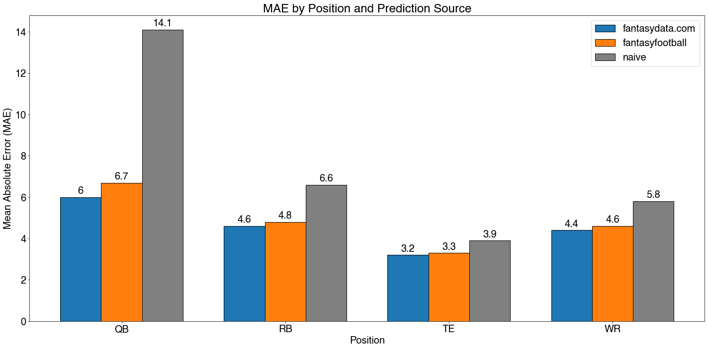

<p align="center">


-----------------

# Welcome to fantasyfootball
[](https://codecov.io/gh/thecodeforest/fantasyfootball)[](https://github.com/psf/black)


**fantasyfootball** is a Python package that provides up-to-date offensive game statistics, betting lines, defensive rankings, and game-day weather data. While many websites provide NFL game data, obtaining it in a format appropriate for analysis or inference requires either (1) a paid subscription or (2) manual weekly downloads with extensive cleaning. **fantasy football** centralizes game data in a single location while also ensuring it is up-to-date throughout the season.

Additionally, **fantasyfootball** streamlines the creation of features for in-season, player-level fantasy point projections. The resulting projections can then determine weekly roster decisions. 

## Installation

```bash
$ pip install fantasyfootball
```

## Why fantasyfootball

Let's walk through an example to illustrate a core use-case of **fantasyfootball**: weekly roster decisions. Imagine it's Tuesday, Week 15 of the 2021 NFL regular season. Your mediocre team occupies 5th place in the league standings, one spot away from the coveted playoff threshold. It is a must-win week, and you are in the unenviable position of deciding who starts in the Flex roster spot. 
You have two wide-receivers available to start, Hunter Renfrow or Chris Godwin, and you want to estimate which player will score more points in Week 15. Accordingly, you use the data and feature engineering capabilities in **fantasyfootball** to create features before making point projections for the upcoming week. The player with the highest point projection will be slotted into the Flex roster spot, propelling your team to fantasy glory in the upcoming playoffs. 

Start by reading all player data from the 2015-2021 seasons.

```python
from fantasyfootball.data import FantasyData

fantasy_data = FantasyData(season_year_start=2015, season_year_end=2021)
```

Next, we'll create our outcome variable that defines the total weekly fantasy points scored by each player. Then, depending on your league's scoring rules, you can supply standard fantasy football scoring systems, including *yahoo*, *fanduel*, *draftkings*, or create your own *custom* configuration. For example, assume you are part of a *yahoo* league with standard scoring.

```python
fantasy_data.create_fantasy_points_column(scoring_source="yahoo") 
```

Now that we've added our outcome variable, we'll extract the data as a data frame and take a look at the past four weeks for Hunter Renfrow. Note that only a subset of the 38 total fields appears below. 

```python
fantasy_df = fantasy_data.data
renfh_df = fantasy_df.query("name=='Hunter Renfrow' & season_year==2021 & 11<=week<=14")   
print(renfh_df[["pid", "week", "is_away", "receiving_rec", 
                "receiving_td","receiving_yds","draftkings_salary",
                "ff_pts_yahoo"]]
     )
```

| pid      |   week |   is_away |   receiving_rec |   receiving_td |   receiving_yds |   draftkings_salary |   ff_pts_yahoo |
|:---------|-------:|----------:|----------------:|---------------:|----------------:|--------------------:|---------------:|
| RenfHu00 |     11 |         0 |               4 |              0 |              30 |                5800 |            5.5 |
| RenfHu00 |     12 |         1 |               8 |              0 |             134 |                5600 |           17.6 |
| RenfHu00 |     13 |         0 |               9 |              0 |             102 |                5800 |           14.7 |
| RenfHu00 |     14 |         1 |              13 |              1 |             117 |                6100 |           22.2 |

We'll create the feature set that will feed our predictive model in the following section. The first step is to filter to the most recently completed week for all wide receivers (WR). 

```python
from fantasyfootball.backtesting import filter_to_prior_week

backtest_df = fantasy_df.filter_to_prior_week(season_year=2021,week_number=14)
features = FantasyFeatures(backtest_df, position="WR")    
```

Now, we'll apply the following transformations to our historical data: 

* `create_future_week` - Adds leading indicators that we can use to make predictions for Week 15. Recall that, in the current example, we only have game data up to Week 14, so we need to create features for a future, unplayed game. For example, the over/under point projections combined with the point spread estimate how much each team will score. A high-scoring estimate would likely translate into more fantasy points for all players on a team. Another example is weather forecasts. An exceptionally windy game may favor a "run-centric" offense, leading to fewer passing/receiving plays and more rushing plays. Such an occurrence would benefit runnings backs while hurting wide receivers and quarterbacks. 
A field, `is_future_week`, is also added during this step and allows for an easy split between past and future data during the modeling process. 
 
* `filter_n_games_played_by_season` - Filters out players who have played only a few games in a season. Setting a threshold is necessary when creating lagged features (which happen to be some of the best predictors of future performance). 

* `add_lag_feature` - Add lags of a specified length for lagging indicators, such as receptions, receiving yards, or rushing touchdowns from previous weeks. 

* `add_moving_avg_feature` - Add a moving average of a specified length for lagging indicators.

* `create_ff_signature` - Executes all of the steps used to create "derived features," or features that we've created using some transformation (e.g., a lag or moving average). 

```python
from fantasyfootball.features import FantasyFeatures

yvar = fantasy_df.columns[-1]
features.create_future_week()
features.filter_n_games_played_by_season(min_games_played=2)
features.add_lag_feature(n_week_lag=[1], lag_columns=[yvar])
features.add_moving_avg_feature(n_week_window=[4], window_columns=[yvar])
derived_features, feature_df = features.create_ff_signature()
```

Having created our feature set and extracted the names of the newly created features, we'll seperate our historical data (training), denoted `hist_df`, from the future, unplayed game data (testing), denoted `future_df`, using the indicator added above during the `create_future_week` step. 

```python
hist_df = feature_df[feature_df['is_future_week'] == 0]
future_df = feature_df[feature_df['is_future_week'] == 1]
```
For the sake of simplicity, we'll leverage a small subset of raw, untransformed features from our original data, and combine these with the derived features we created in a previous step. 

```python
raw_features = ["is_active", "avg_windspeed", "receiving_def_rank", "draftkings_salary"]
all_features = raw_features + derived_features
```

Let's split between our train/hist and test/future data. 
```python
from janitor import get_features_targets

X_hist, y_hist = hist_df[all_features + [yvar]].get_features_targets(yvar, all_features)
X_future = future_df[all_features]
```

Now we can fit a simple model and make predictions for the upcoming week. 

```python
from sklearn.ensemble import RandomForestRegressor

rf = RandomForestRegressor(n_estimators=1000, 
                           max_depth=4,                            
                           random_state=0)
rf.fit(X_hist.values, y_hist.values)
y_future = rf.predict(X_future.values)
```

Below we'll assign our point predictions back to the original `future_df` we created for Week 15 and filter to the two players in questions. 

```python
future_df = future_df.assign(**{f"{yvar}_pred": y_future})
players = ['Hunter Renfrow', 'Chris Godwin']
future_df[["name", "team", "opp","week", "date", f"{yvar}_pred"]].query("name in @players")
```

| name           | team   | opp   |   week | date       |   ff_pts_yahoo_pred |
|:---------------|:-------|:------|-------:|:-----------|--------------------:|
| Chris Godwin   | TAM    | NOR   |     15 | 2021-12-19 |             12.2594 |
| Hunter Renfrow | LVR    | CLE   |     15 | 2021-12-20 |             14.9204 |

Based on our point projections, we should start Hunter Renfrow over Chris Godwin, as he is expected to score ~2.75 more points this week. 

## Benchmarking

The main goal of the fantasyfootball package is to provide football enthusiasts with the data and tools to create "industry-grade" player point projections customized for their league's scoring system. Indeed, a simple comparison between (1) a "naive" projection, and (2) a subscription-based, "industry-grade" projection, revealed that accurate weekly player-level predictions are achievable with the fantasyfootball package. 

Naive projections are a one-week lag of points scored by each player from the previous or last active week. The "industry-grade" projections are from a subscription-based fantasy sports website (www.fantasydata.com). Projection accuracy was assessed for the 2020 and 2021 seasons, starting with week three and ending with week 16, for 28 games. The Mean Absolute Error (MAE) quantified projection performance. The forecasting horizon is one week ahead, and the Yahoo scoring system determined point projections for each player. Separate models are fit for each position (QB, RB, WR, TE). Projection performance was considered only for "active" players for the week and excluded all injured or ineligible players. 




## Datasets
The package provides the following seven datasets by season: 

* **calendar** - The game schedule for the regular season. 

    * `date` - Date (yyyy-mm-dd) of the game
    * `week` - The week of the season
    * `team` - The three letter abbreviation of the team
    * `opp` - The the letter abbreviation of the team's opponent
    * `is_away` - Boolean indicator if the `team` is playing at the opponent's field
    * `season_year` - The year of the season

<br>

* **players** - Each team's roster. Note that only Quarterbacks, Runningbacks, Wide Receivers, and Tight Ends are included. 
    * `name` - A player's first and last name
    * `team` - The three letter abbreviation of the player's team
    * `position` - The two letter abbreviation of the player's position
    * `season_year` - The year of the season

<br>    

* **stats** - The aggregated game statistics for each player. 
    * `pid` - Unique identifier for each player. 
    * `name` - A player's first and last name 
    * `team` - The three letter abbreviation of the player's team
    * `opp` - The three letter abbreviation of the players's weekly opponent 
    * `is_active` - A boolean indicator if the player is active (1) or inactive (0)
    * `date` - Date (yyyy-mm-dd) of the game
    * `result` - The box score of the game, along with an indicator of the outcome (W or L)
    * `is_away` - Boolean indicator if the game was played at the opponent's field (1 = away, 0 = home)
    * `is_start` - Boolean indicator if the player started the game (1 or 0)
    * `g_nbr` - The game number for the player. This differs from the week number, as it accounts for team buy weeks. 
    * `receiving_rec` - The total number of receptions
    * `receiving_yds` - The total number of receiving yards
    * `receiving_td` - The total number of receiving touchdowns
    * `rushing_yds` - The total number or rushing yards
    * `receiving_td` - The total number of rushing touchdowns
    * `passing_cmp` - The total number of completed passes
    * `passing_yds` - The total number of passing yards
    * `passing_td` - The total number of passing touchdowns
    * `fumbles_fmb` - The total number of fumbles
    * `passing_int` - The total number of passing interceptions
    * `scoring_2pm` - The total number of 2-point conversions
    * `punt_return_tds` - The total number punt return touchdowns

<br>

* **salary** - The player salaries from DraftKings and FanDuel.
    * `season_year` - The year of the season
    * `name` - A player's first and last name 
    * `position` - The two letter abbreviation of the player's position
    * `week` - The week of the season
    * `team` - The three letter abbreviation of the team
    * `opp` - The three letter abbreviation of the team's opponent
    * `opp_position_rank` - Opponent rank based on fantasy points allowed by position
    * `fanduel_salary` - Fanduel player salary
    * `draftkings_salary` - DraftKings player salary

<br>

* **weather** - The game-day weather conditions. 
    * `date` - Date (yyyy-mm-dd) of the game
    * `team` - The three letter abbreviation of the team
    * `opp` - The three letter abbreviation of the team's opponent
    * `stadium_name` - Name of the stadium hosting the game. Updated as of 2020. 
    * `roof_type` - Indicates if stadium has dome, retractable roof, or is outdoor. 
    * `is_outdoor` - boolean indicator if stadium is outdoor (1 = is outdoor, 0 = retractable/dome). Note that for stadiums with a retractable roof, it is not possible to determine if roof was open during the game. 
    * `avg_windspeed` - Average daily windspeed (mph)
    * `max_snow_depth` - The maximum depth of the snow (in)
    * `total_precip` - Total daily precipitation (in)
    * `avg_temp` - Average daily temperature (f&deg;). Note that the `avg_temp` of dome/retractable roof stadiums are set to 75&deg;.


<br>


* **betting** - Offensive point projections that are derived from the opening over/under and point-spread. Opening point spreads are refreshed the Tuesday of each week.

    * `team` - The three letter abbreviation of team with the point projections
    * `opp` - The three letter abbreviatino of the team's opponent
    * `projected_off_pts` - The projected number of points for each team. For example, if the over/under for a game is 50, and one team is favored to win by 4 points, then the favored team is projected to score 27 points, while the underdog is projected to score 23 points. 
    * `date` - Date (yyyy-mm-dd) of the game
    * `season_year` - The year of the season

<br>

* **defense** - The relative strength of each team's defense along rushing, passing, and receiving. Rankings are updated on Tuesday of each week. 

    * `week` - The week of the season
    * `opp` - The three letter team's abbreviation
    * `rushing_def_rank` - Ordinal rank (1 = Best, 32 = Worst) of defensive strength against rushing offense. Combines total rushing yards and total rushing touchdowns to determine strength. The relative weight on each dimension is adjustable. 
    * `receiving_def_rank` - Ordinal rank (1 = Best, 32 = Worst) of defensive strength against receiving offense. Combines total receiving yards and total receiving touchdowns to determine strength. The relative weight on each dimension is adjustable. 
    * `passing_def_rank` - Ordinal rank (1 = Best, 32 = Worst) of defensive strength against passing offense. Combines total passing yards and total passing touchdowns to determine strength. The relative weight on each dimension is adjustable. 
    * `season_year` - The year of the season


## Contributing

Interested in contributing? Check out the contributing guidelines. Please note that this project is released with a Code of Conduct. By contributing to this project, you agree to abide by its terms.

## License

`fantasyfootball` was created by Mark LeBoeuf. It is licensed under the terms of the MIT license.


